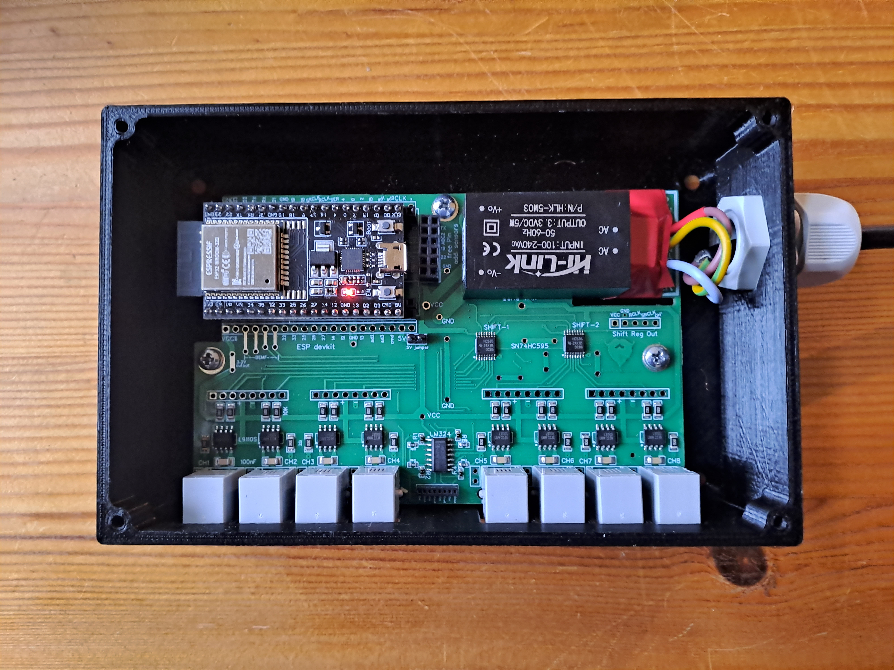

# Outside temperature and weather-compensated return flow temperature heating control

By a supply flow temperature heating control, there is only little feedback about what is actually being consumed by the heating surfaces.

With return flow temperature heating control, the feedback comes from the heating surfaces.

- The heating water comes back colder if more energy is consumed and the heating control adjusts accordingly.
- The heating water comes back warmer when less energy is consumed.
- With this control method, the return flow becomes the reference variable.
- Continuous monitoring of the return flow temperature enables conclusions to be drawn about the heat requirements of the heating system or the house.

## Return flow target temperature, Return flow heating curve

The heating (heat producer) measures the outside temperature via a sensor and uses the supply flow heating curve to calculate a target supply flow temperature for each heating group.
Depending on this target supply flow temperature, the target return flow temperature is determined by calculating the return flow heating curve.

- Depending on the outside temperature, a target supply flow temperature is calculated for the respective heating group (heating circuit) by using a supply flow heating curve.
  The calculated target supply flow temperature can be limited with an adjustable minimum and maximum value.
- The return flow heating curve is a supply flow heating curve reduced by the spread.
  Due to different pipe lengths and flow rates, heating circuits react differently.
  Therefore a hydraulic and/or thermal balancing is mandatory and must be carried out before, otherwise trustable spread calculation will fail.
- Calculation of the spread and the resulting target return flow temperature for each heating group (heating circuit).

## Return flow temperature heating control

When the return flow temperature approaches its setpoint, it can be assumed that the rooms are warm and that each room has reached the optimal return flow temperature to achieve and maintain the desired room temperature.

- The return flow temperature of the heating group is limited to a calculated maximum return flow temperature.
  The valve is now closed in a modulating manner so that the return flow temperature decreases.
  If the energy consumption changes, the modulation can be changed for modulating burners.
  With modulating burners this is the most ingenious solution, so burners run all day long.
- If the measured return flow temperature is higher than the calculated maximum return flow temperature, a compensation value is calculated using a PID controller and the heating (heat producer) supply flow temperature of the heating group is reduced.
- If the return flow reaches the switch-off temperature, the burner is switched off.
- The cooling phase of the heating water begins.
- The supply flow temperature drops very quickly to the temperature level of the return flow.
- When the return flow temperature switch-on point is reached, the burner can start.
- For single-stage burners, it extends the running times and prevents frequent burner starts (cycling).

## Combined heating control

The combined heating control uses a room temperature sensor in addition to the return flow sensors.
In combined control, the heating (heat producer) is only switched off when the desired room temperature has actually been reached.

If the return flow temperature increases slowly, a lot of heat is being absorbed by the heating system.
- The valves are open.
- There is less external heat.

If the return flow temperature rises quickly, the heat demand of the heating system is lower.
- Some valves are closed here because external heat is present.

If the return flow temperature falls quickly, the heating system requires a lot of heat.
- The valves are open.

In general, a distinction can be made between the following two cases:

1. Generally too high/low temperature
   Can be corrected via the target temperature of the room and, if necessary, changing the offset of the heating curve.
2. Temperatures changing too slowly/quickly
   Too slow/quick adaptation to the outside temperature can be corrected by changing the slope of the heating curve.

A return flow temperature heating control has significant energy saving potential because it dynamically adapts to the actual energy consumption.

Energy savings are achieved through the
- Reduction of heating cycles (on/off of the heating (heat producer)
- Lowering the supply flow temperature level
- Use of internal and external heat gains

Since this control principle is generally unknown or not understood, it is rarely used.
The behavior of the heating surfaces, the water volume flows and the correct regulation are different.

**Important**:

Return flow temperature heating control principle only works if a hydraulic calibration and later a thermal calibration have been carried out.

# Hydraulic Balancing

The hydraulic balancing for underfloor heating described below is carried out **according to a return flow temperature method**.

By **balancing all heating loops to the same return flow medium temperature**, a very precise hydraulic balancing is possible,
which reflects the actual conditions of the heating system, taking into account all building and heating circuit influencing factors.

By continuously analyzing the curves of outside, room, flow and return temperatures and taking weather forecast data into account, the optimal floor temperature is calculated at any time.
This information is then used in regular operation as the basis for a constantly adapting **dynamic hydraulic balancing**.

## Problems with conventional calculation methods / balancing procedures / system setups

- Particularly in existing buildings, the pipe lengths, pipe cross-sections and installation distances required for an accurate calculation can usually only be estimated
- Temperature and pressure losses in the distribution system are generally not adequately taken into account

Through the use of

- Fixed flow limiter
- Conventional on/off actuators/valves

a conventional static hydraulic balancing is always **designed only for a single operating situation**:

- **FULL LOAD for ALL rooms**.

However, this only very rarely reflects reality.

## Dynamic Hydraulic Balancing

A **dynamic hydraulic balancing** dynamically adapts the hydraulic balancing for each operating situation.
By using **infinitely adjustable actuators/valves**, the flow rates are dynamically **adjusted for every operating situation**.

If the operating situation allows it, actuators can also be opened beyond the value specified in this static adjustment.
In most operating situations (full load is very rare!), rooms can be heated up many times faster, pump outputs can be dimensioned lower and the flow temperature can be significantly reduced.

## Requirements for starting the hydraulic balancing
### Same room temperature in all rooms followed by a cooling phase

Wichtigste Voraussetzung für ein erfolgreiches Resultat ist ein geeigneter Initialzustand der Fußbodenheizung.

Die Fußbodenheizung muss beim Start des hydraulischen Abgleichs in allen Räumen auf einem möglichst gleichen Temperaturniveau sein.
Geringe Unterschiede können während des hydraulischen Abgleichs ausgeglichen werden.
Jedoch funktioniert es NICHT, seit Tagen/Wochen unbeheizte Räume zusammen mit ständig beheizten Räumen abzugleichen.

Erfahrungsgemäß funktioniert die nachfolgende Vorgehensweise sehr gut:

- Heizen Sie alle Räume im Haus auf die gleiche Temperatur (z.B. 20°C).
  Diese Temperatur muss für mindestens 24 Stunden gleichmäßig gehalten werden.
- Schalten Sie danach alle Räume für 24 Stunden aus.
  Alternativ (z.B. bei sehr kalten Außentemperaturen) so lange ausschalten, bis jeder Raum um 2°C abgekühlt ist.

Es ist unumgänglich, diese Schritte vor dem Start des hydraulischen Abgleichs durchzuführen.
Das Ergebnis wird sonst nicht verwertbar sein.

### Open the flow rate limiter 100% (except for very short heating loops)

Alle Durchflussmengenbegrenzer müssen vor dem Start des hydraulischen Abgleichs maximal geöffnet sein.

Die Durchflussmengenbegrenzer bei Räumen mit bekannt sehr kurzen Heizschleifen können etwas zugedreht werden.

**Die Ventilöffnung sollte bei keinem Stellantrieb auf weniger als 25% begrenzt werden müssen.**

### Outside temperatures <10°C

Aufgrund mehrerer Effekte, lässt sich beim Rücklauftemperatur-Verfahren der hydraulische Abgleich einfacher und genauer durchführen, je kälter die Außentemperaturen sind.
Sofern Sie bei Plusgraden kein ausreichendes Ergebnis erhalten, wiederholen Sie den Abgleich also am Besten nochmal bei kälteren Außentemperaturen.

Über einer Außentemperatur von 10°C ist ein hydraulischer Abgleich mit dem Rücklauftemperatur-Verfahren nicht möglich.

### The underfloor heating pump must be switched on permanently

Stellen Sie sicher, dass die Fußbodenheizungspumpe während des hydraulischen Abgleichs dauerhaft läuft.
Stellen Sie in der integrierten Steuerung Ihres Wärmeerzeugers die Pumpe bitte übergangsweise auf Dauerbetrieb.

### Sufficient flow temperature (deactivate night setback!)

Für die Dauer des hydraulischen Abgleichs muss eine ausreichende Vorlauftemperatur sichergestellt sein.
Der Wärmeerzeuger darf sich beispielsweise nicht in der Nachtabsenkung befinden.

### Minimize/exclude further influences

Während des hydraulischen Abgleichs dürfen keine Fenster oder Türen geöffnet sein, und es dürfen keine zusätzlichen Wärmequellen (z.B. Kachelöfen) die Messungen verfälschen.
Ebenso sollten externe Effekte wie z.B. Sonneneinstrahlung durch Testdurchläufe nach Sonnenuntergang ausgeschlossen werden.

## Implementation and work steps

Der hydraulische Abgleich über das Rücklauftemperatur-Verfahren erfolgt in folgenden aufeinander aufbauenden Schritten.

1) Automatischer statischer hydraulischer Abgleich
2) Dynamischer hydraulischer Maximalabgleich (DHMA) mit Maximaldurchfluss-Anpassung
3) Regelbetrieb mit Deep-Learning

### Step 1: Automatic static hydraulic balancing

Beim automatischen statischen hydraulischen Abgleich werden alle Heizkreisverteiler und alle Heizkreise des Gebäudes gleichzeitig einbezogen und untereinander valide mittels des Rücklauftemperatur-Verfahrens abgeglichen.
Die Durchflussmengen werden über stufenlos einstellbare Stellantriebe so lange begrenzt, bis alle Heizschleifen die gleiche Rücklauftemperatur aufweisen.

Hierbei werden in einem Testdurchlauf (z.B. 30 min) zeitgleich die Rücklauftemperaturen in allen Heizkreisen gemessen und in einem Diagramm dargestellt.
Nach jedem Testdurchlauf werden die Durchflussmengen der wärmsten Rückläufe begrenzt (durch Anpassung der Ventilöffnungen der stufenlos einstellbaren Stellantriebe) – so lange, bis alle Heizschleifen die gleiche Mitteltemperatur aufweisen.

1) Initialaktion
   Öffnung aller Ventile für beispielsweise 30 min um einige physikalisch bedingte Verzögerungen abzudecken.
   - Es dauert z.B. einige Minuten, bis das Controme Gateway das Öffnungssignal an die Stellantriebe sendet,
   - die Stellantriebe benötigen wiederum ein paar Minuten, um tatsächlich zu öffnen.
   - Des Weiteren sollten alle Heizschleifen zunächst für einige Minuten Durchfluss haben, bevor die Rücklauftemperaturen bewertet werden.
   - Darstellung aller Rücklauftemperaturen in einem Diagramm.
2) Start der ersten Testsequenz.
3) Nach Abschluss der beispielsweise 30 min Testsequenz werden die Ventilöffnungen der stufenlos einstellbaren Stellantriebe einmalig angepasst.
   - Nach jedem Durchlauf wird für jeden Sensor der Mittelwert berechnet.
   - Die Differenz aller Mittelwerte ergibt das Ergebnis des Durchlaufs.
   - NACH jedem Durchlauf werden die Ventilöffnungen der wärmsten Rückläufe verringert.
   - Die Maximalöffnungen werden für jedes Ventil auf der Geräteseite der Fußbodenheizungssteuerung(en)-PRO dargestellt.
   - Das AHA-Plugin passt also die dargestellten Maximalöffnungs-Werte (die Slider) am Ende jedes AHA-Durchlaufs automatisch an.
4) Start der nächsten Testsequenz mit den neuen verbesserten Ventilöffnungen (Maximalöffnungs-Werte).
5) Dieser Prozess wird so lange wiederholt, bis alle Heizschleifen eine Mitteltemperatur aufweisen, die um weniger als 2K voneinander abweicht.

**Wichtig**:
Die Ventilöffnung sollte bei keinem Stellantrieb auf weniger als 25% begrenzt werden müssen.
Diese Durchflussmengenbegrenzer müssen etwas zugedreht werden. 

**Bitte beachten**:
Während eines Durchlaufs selbst werden die Maximalöffnungen nicht angepasst.
Das Plugin wertet jeden Durchlauf am Ende aus und passt dann einmalig die einzelnen Maximalöffnungen an.
Es sind also IMMER mehrere Durchläufe notwendig, bis sich die Rücklauftemperaturen im gewünschten Bereich von 2K befinden.

### Step 2: Dynamic hydraulic maximum adjustment with maximum flow adjustment

Die im zuvor beschriebenen automatischen statischen hydraulischen Abgleich ermittelten maximalen Öffnungswerte für jede Heizschleife sind ausschließlich 
für die Betriebssituation Vollast (“Alle Räume sollen aktuell mit maximaler und gleicher Menge an Wärmeenergie versorgt werden“) optimal.
Diese Betriebssituation ist jedoch sehr selten.

Der dynamische Abgleich Maximalabgleich (DHMA) berechnet deshalb aufbauend auf den im automatischen statischen hydraulischen Abgleich ermittelten Werten,
individuell zu jeder Betriebssituation die maximal mögliche Ventilöffnung für jede Heizschleife.

Der innovative DHMA-Regelalgorithmus berücksichtigt dabei alle aktuellen Betriebsinformationen und entscheidet intelligent für jede einzelne Heizschleife,
ob ein Ventil bei Bedarf über den im automatischen hydraulischen Abgleich (AHA) ermittelten Maximalwert geöffnet werden darf.
Smart-Heat OS stellt dabei gleichzeitig immer die Versorgung aller anderen Räume sicher.

- Dadurch können Aufheizzeiten stark verkürzt werden.
- Es wird bei gleicher Heizleistung eine geringere Vorlauftemperatur benötigt.
- Es ist weniger Leistung der Heizkreispumpe notwendig, da die Pumpe nicht gegen unnötig limitierte Ventile andrücken muss
  (Hinweis: Eine Differenzdruck-geregelte Pumpe adaptiert dies automatisch).

### Step 3: Regular operation with deep learning

Das beschriebene Plugin “hydraulischer Abgleich” übergibt in der Folge laufend die maximal erlaubte Öffnung
jeder Heizschleife an den KI-Regelalgorithmus für Fußbodenheizungen.

Dieser analysiert mit Deep-Learning Methoden die Verläufe der Raum- und Rücklauftemperaturen und errechnet
daraus unter Berücksichtigung von Wettervorhersage-Daten zu jedem Zeitpunkt die optimale Fußbodentemperatur.
Entsprechend dem Ergebnis wird dann die tatsächliche Öffnung jedes Stellantriebs eingestellt.

# Heating controller

# References

- http://www.bosy-online.de/Einstellen_der_Heizkurve.htm
- https://www.haustechnikdialog.de/SHKwissen/2481/Ruecklauftemperaturregelung
- https://www.haustechnikdialog.de/SHKwissen/341/Heizkurve
- https://www.controme.com/hydraulischer-abgleich/
- https://support.controme.com/hydraulischer-abgleich/

# xxxxxxxxxxxxxxxxxxxx

FBx : Fussbodenheizkreis x
TV  : Vorlauftemp.
TR  : Rücklauftemp.
VS  : Volumenstrom

FB1 - Hauptlast: hoher VS, hohe RT
FB2 - Teilast  : kleiner VS, kleine RT
